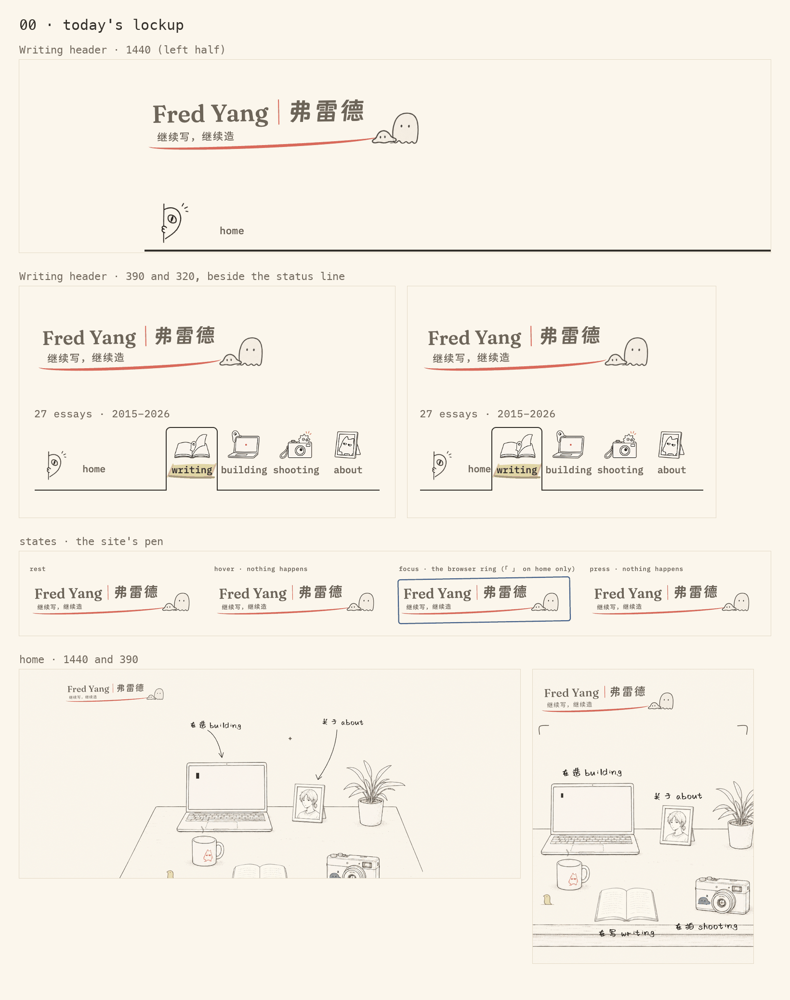
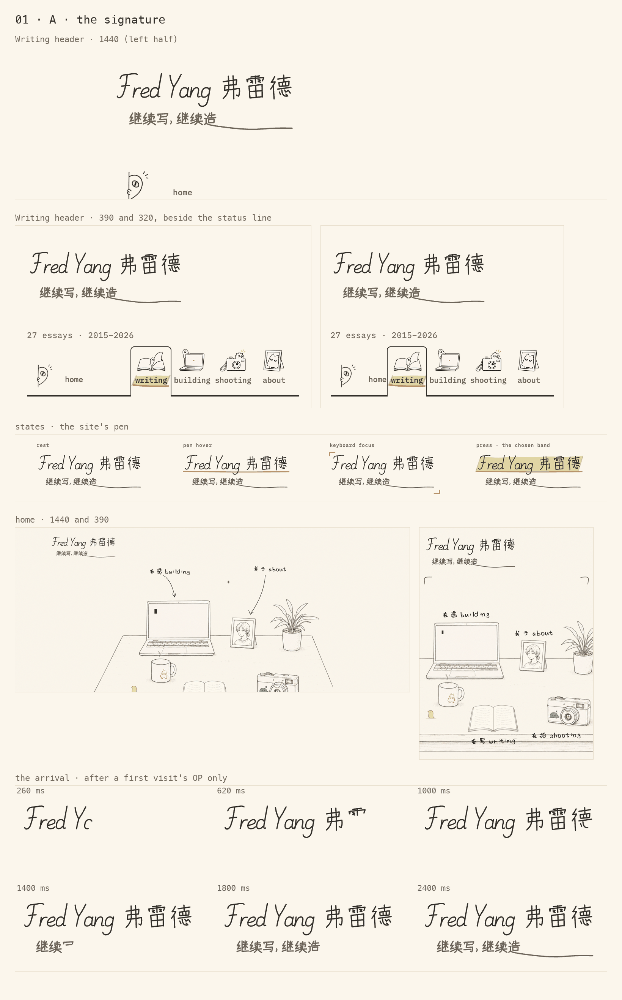
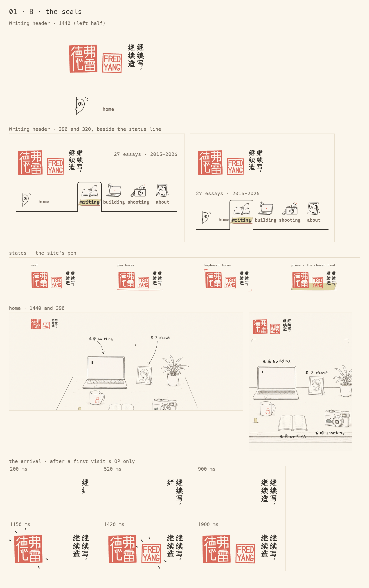
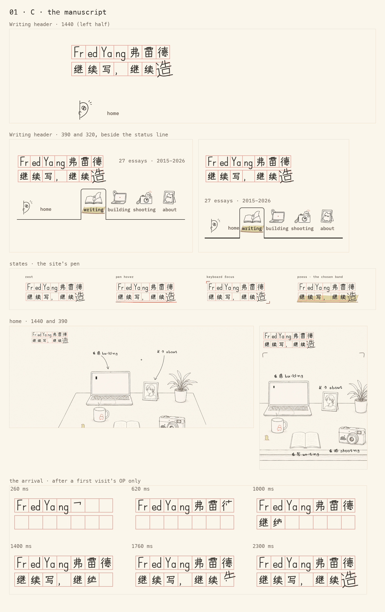

# Identity: a hand-made lockup (round 1)

The top-left identity on every page, redesigned. Round 1 renders three candidates next to today's lockup and stops for Fred's pick; nothing here touches production.

Board: <http://127.0.0.1:4173/design/2026-09-identity/> (serve the repository root). Every frame on it is live: real page headers, the real home page with the candidate in its header, the site's own pen for hover and focus. A reduced-motion switch sits in the top bar.

Fred's brief: "Not hand-made enough." "I just want to see what you'll design." The tagline stays word for word, 继续写，继续造: "造在中文里既是呼应build，而且也带有戏谑的'实验性'和'挑衅'（造作）的意思".

Execution mode: multi-stage (the visual guide's workflow). Round 1 is candidates; refinement waits for Fred's selection.

## Audit: today's lockup

What it is: one link to `index.html` in each static header (`.site-identity`, styles in `site-nav.css` lines 8–20 and 87–93), `.home-id` on home, and the same markup in the eight `building/` sub-site pages: thirteen copies in all. "Fred Yang" in Fraunces 25 px and 弗雷德 in DingTalk JinBuTi 26 px, both in `--soft`; a 1.6 px coral rule between them; 继续写，继续造 in Noto Sans SC 10.5 px; a coral swoosh drawn as a `border-radius` ellipse; two sticker PNGs (ghost, blob) at 78 % opacity; the whole block rotated −1°. 305 × 81 px at 1440, 252 × 75 px on phones.

What it does well: it's bilingual, it's small, the motto is set in a readable utility face (5.33:1), and it keeps one box on home and pages, so the `identity` view transition only moves it.

What it doesn't do:

- **Nothing in it was made by a hand.** Every mark is typeset (three faces) or geometric (an ellipse, a rule). The only drawn things are two pasted rasters, faded, which reads as washed out rather than as ink. The −1° tilt stands in for a hand, the "noise to look hand-made" the guide warns against.
- **Its coral at rest speaks the pen's language.** A coral line under text is what hover means everywhere else on the site, and the swoosh's right end rises: the rising tail the pen rules forbid under a word.
- **It is the one header link without pen states.** Hover does nothing. Keyboard focus is the browser's blue ring on pages (rotated with the block) and coral 「 」 on home only, because only `lib/home/desk.js` wires a FocusMark.
- **Its accessible name drops half of it.** `aria-label="Fred Yang — home"` hides 弗雷德 and the motto from screen readers, and an aria-label can't mark Chinese as `lang="zh"`.
- **Phones.** At 390 and 320 the status line wraps under it and the header row grows to 110 px.
- **Reading** has no `.site-identity`: its compact header shows the favicon portrait (34 px, `alt="Fred Yang"`, not a link) and a back link, and its nav's peek sticker is the way home. So Writing ↔ Reading never carries an identity (that move has no view transition anyway).
- Found on the way, outside this brief: in the `building/` sub-sites, `assets/fred-agent/fred-agent.css` points its `@font-face` at `./fonts/…` relative to itself (a 404), so 弗雷德 falls back to a system face there, and it names the full font masters rather than the subsets.

## The three candidates

Each is a different hand: the site's pen signing (A), a knife carving seals (B), a careful hand filling the writer's squared paper (C). They were kept apart in silhouette (a free line, a red block, a grid), carrier (line, colour, both) and mechanism (signing, stamping, filling in). Source-form distance stays low to medium on purpose: this is a name, and legibility is its job; a high-distance identity was considered and set aside.

All three share these decisions:

- `.site-identity` stays one link to `index.html`. Its accessible name comes from visually hidden text with `lang` spans (so 弗雷德 and the motto are read in Chinese) and carries the motto's English echo: "Fred Yang, 弗雷德. 继续写，继续造: keep writing, keep making. Home". The drawing is `aria-hidden`.
- Every mark is drawn: hand-authored stroke paths in writing order and direction (`01-glyphs.js`), placed in px so one pen weight holds whatever the size. No font outline was traced and no glyph comes from a font, so the font subsets don't change (glyph cost 0) and no Google Fonts are added.
- The pen's states come from `Tier.wire`, as on every nav link: a coral underline hung from the drawn baseline on hover, coral 「 」 on keyboard focus, the wheat band on press. `scripts/verify/pen-spacing.mjs` run on the candidates' headers at 1440, 390 and 320 finds 54 underlines and 0 violations.
- The tilt and the stickers are gone: the hand now carries the identity.
- One box on home and pages, so the `identity` view transition only translates (measured: no move at 1440, the same −3.6, −12 px as today at 390). Nothing redraws during a move.
- The arrival (writing, stamping) has one cause: the end of a first visit's OP on home (`opx:done`). The page is covered until then, and a visitor who skipped the OP gets the identity at rest. It never plays on other pages or on a view-transition arrival. Reduced motion lands it at once; the opener never plays then anyway. On the board, "play the opener on home" runs the real opener, and it ends in the arrival.
- No overflow at 320. Contrast: ink 12.2:1; `--soft` 5.33:1.

### A · 签 the signature

The pen that marks the whole site signs it. "Fred Yang" in a signing hand, 弗雷德 in the same hand written quickly, and the motto under it in the same pen, drawn a value lighter. 造's last stroke doesn't stop: its 平捺 runs on under the whole name as the signature's paraph.

| | |
|---|---|
| source-form distance | low: the name and the motto as a hand writes them; every character keeps its structure and stroke order |
| primary carrier | line-led; colour absent at rest |
| rendering resolution | moderate: the name, the motto under it, one flourish |
| expression anchor | the pen's cadence: a lead-in on the F, a foot on its stem, exit flicks; 弗雷德 in running-hand habits (弓 in one run, 彳 as a Z, 纟 in one run); one stroke that won't stop |
| line plan | one pen, 1.7 px (1.55 on phones), round and blunt; hierarchy by value, not weight: the name in ink, the motto and its paraph in `--soft` (the guide's "the fold is drawn lighter") |
| colour plan | none at rest; coral only as the pen's live attention (hover line, focus 「 」); press sinks into the wheat band |
| 造 | its 平捺 runs on under the name as 一波三折: down into a trough below the motto's baseline (so it reads as a flourish, not a blank to fill in), then level, blunt. The showing-off stroke (造作) that is also the line the name stands on (造, build) |
| English echo | the accessible name only; the lockup already pairs both names |
| size | 247 × 90 at 1440; 214 × 83 on phones. The status line wraps under it at 390 and 320, as today |
| arrival | the name in one go, a breath, the motto quicker, then the sweep: 2.2 s |

现在的署名全是排出来的：Fraunces、钉钉进步体、思源黑体，一道 CSS 椭圆，两张调低了透明度的贴纸；"手感"只是整块歪了 1°。A 把署名交还给网站自己那支笔：Fred Yang 用签名的手写，弗雷德用同一只手写快一点（弓一笔带过，彳写成一个 Z），下面一行继续写，继续造用同一支笔、淡一档的墨，层次靠深浅而不靠粗细。造的最后一笔平捺不肯停，一波三折地拖到整个名字底下，成了签名的花押：既是炫技（造作），也是名字站着的那条线（造）。静止时没有一点珊瑚色，珊瑚色只在笔注意到它的时候出现。

### B · 印 the seals

The one red on an ink drawing is where the maker stamps it. A white-text name seal (白文) with 弗雷德 in the classic 2 + 1 layout (弗 雷 down the right column, 德 the whole left), a red-text seal (朱文) with FRED YANG: the pair a scholar stamps under an inscription. The inscription (款) is the motto, written in two columns right to left, 继续写， then 继续造, and it ends beside the seals.

| | |
|---|---|
| source-form distance | medium: the name rewritten in the seal's grammar (印化): straightened, redistributed into a square, carved |
| primary carrier | colour-led: the coral mass of the white-text seal carries the identity; the red-text seal's lines and the inscription are subordinate |
| rendering resolution | low: one red event, a smaller second seal, a quiet inscription |
| expression anchor | the carve: square cuts and mitred corners, a different knife width per character, each impression a hair off level (stamped by hand, twice), one nick in the stone's edge. Flat colour, no paste grain: texture would be camouflage |
| line plan | cuts about 2.2 px; the inscription in the site's pen at 1.45 px, ink |
| colour plan | coral is the seal: the header's one material accent (the fixed identity the coral rule allows); ink for the inscription; paper shows through the carving. Highest chroma: the white-text seal |
| 造 | the seals are what was made: a maker's mark (…造, as potters and swordsmiths sign) for build, and the pomp of stamping your own website like a scholar's painting for 造作. The motto ends on 造, right beside them |
| English echo | FRED YANG is carved, so the Latin name is in the mark; the motto's echo is in the accessible name |
| contrast | carved glyphs are large (22–26 px) at 3.19:1 on coral, which meets the 3:1 bar for large text (and it's a logotype); the inscription is ink |
| size | 180 × 79 at 1440; 158 × 71 on phones. At 390 the status line fits beside it (the header row loses a line); at 320 it wraps |
| arrival | the pen writes the inscription (0.9 s), then the seals land on held frames with the corkboard pin's two frames of impact ticks: 1.6 s |

一幅水墨画上唯一的红，是作者盖的章。B 把网站的珊瑚色当成印泥：一方白文名章，弗雷德用传统的"二加一"排法（右列弗、雷，左列一个德通到底）；一方朱文章刻 FRED YANG，正是文人落款最常见的一白一朱。旁边两列竖写的款，从右往左：继续写，继续造。章是刻的，不是写的：方头、直线、每个字的刀口宽窄不一，石边崩了一个小口；平涂的珊瑚色，不做印泥颗粒。造在这里就是章本身：做出来的东西（造），加上给自己的网站郑重其事盖两方章的那份自得（造作）。"继续造"的造，正好落在印旁边。

### C · 稿 the manuscript

Writers write on 稿纸. A strip of it, two rows of seven squares printed in the identity's coral, filled in the careful hand one character to a square: Fr|ed|Ya|ng|弗|雷|德 over 继|续|写|，|继|续|造. The paper's own rules set it: Latin letters two to a square, the comma in its own square, low on the left. The ruling is the machine; the writing is the person. One character won't be ruled.

| | |
|---|---|
| source-form distance | low for the words, inside a quoted object (稿纸) and its conventions |
| primary carrier | hybrid: without the ruling it is handwriting; without the hand it is an empty form |
| rendering resolution | moderate: an even rhythm of fourteen squares, and one break in it |
| expression anchor | printed against written: crisp ruling, the careful hand inside it, and 造 written a size too big and leaning, over its square's walls |
| line plan | the ruling: 1 px, crisp, coral at 62 % (a printed hairline that carries no information); the writing: 1.6 px ink, round |
| colour plan | coral only as the printed ruling, at hairline value; everything written is ink |
| 造 | the one that won't stay in its square: 造作, and 造反, on an otherwise good sheet. And 稿纸 is the writer's paper, for 写 |
| English echo | the accessible name only; the Latin name is in the grid |
| size | 229 × 78 at 1440; 200 × 69 on phones. At 390 the status line fits beside it; at 320 it wraps |
| arrival | the grid is there from the start (printed); the hand fills it square by square, pauses, and takes its time over 造: 2.0 s |

写作的人用稿纸。C 是一条两行七格的稿纸，用署名的珊瑚色印格子，用端正的手一格一字地填：Fr|ed|Ya|ng|弗|雷|德，下面是继|续|写|，|继|续|造，七格对七格，照稿纸自己的规矩：西文两个字母占一格，逗号独占一格、靠左下。格子是机器，字是人。只有一个字不守格：造写大了一号、歪着，压过了自己的格线。造作，也是造反，落在一张其余都规规矩矩的稿子上。

## What each would cost to build

The same for all three, and small:

- **Assets:** none new. Each lockup is one inline SVG in each page's static header: 7.7–9.0 KB raw, 2.3–2.6 KB gzipped (A 2,552 B, B 2,327 B, C 2,371 B). Today's lockup fetches two sticker PNGs (19.4 KB at 2x) on every page, so each candidate is lighter on the wire and makes two fewer requests. The phone size can be the same SVG scaled by CSS. It must be inline, not an ``: the header has to paint complete at `pagereveal`, before an image would load.
- **Fonts:** no glyphs added, no new Google Fonts. The subsets don't change: the lockups draw their letters, and the hidden accessible text uses only characters every subset already has (继续写造弗雷德).
- **Markup:** replace the identity markup in its thirteen copies: `index.html`, the four gateway `.dc.html` pages and the eight `building/` pages (the sub-sites also need the shared tokens). Replace the `.site-identity*` rules in `site-nav.css` (about 20 lines) with about 10. Retire `assets/identity-sticker-*.png`.
- **JS:** wire the identity in `site.js` with `Tier.wire` (one line; today it has no pen states on pages) and swap `desk.js`'s FocusMark line for it on home. The arrival is about 30 lines in `lib/home/`, listening for `opx:done`. B adds its stamp: two `Motion.held` animations.
- **Production stroke data:** `01-glyphs.js` (the careful hand, the fast hand, two Latin hands) and each candidate's layout code generate the SVG. A port would bake the chosen one's SVG once and paste it into the headers; the stroke data would live on for the arrival.

## What I decided on Fred's behalf

- Dropped the ghost and blob stickers and the −1° tilt in all three.
- The motto's English echo is "keep writing, keep making" (making, not building: it keeps 造's double sense of making things, and making things up), in the accessible name only.
- Latin first, as today, in every candidate.
- The arrival plays only after a first visit's OP, and never after a skipped one.
- A's motto is drawn in `--soft`. B's seals use the identity coral (`--mark`), not `--mark-deep`, even though the deeper red would pass 4.5:1 for carved text. C leaves no empty square between the two scripts, to keep seven over seven.

## Open questions (for round 2, not for now)

- Reading's compact header: should it carry the identity too? B has a natural compact form (the white-text seal alone works at 34 px); A would shrink to its F; C to one square.
- Should the phone header let the status line sit beside the identity where it fits (B and C at 390)?

## Files

- `index.html` (the board), `01-board.css`, `01-board.js`
- `01-frame.html`: one live context (a page's static header, the lockup alone, or its four states), `?c=now|A|B|C&view=header|solo|states&page=…&state=…&play=1&rm=1`
- `01-kit.js` (placing strokes, the pen's write-on), `01-glyphs.js` (the hand-authored strokes), `01-a-sign.js`, `01-b-seal.js`, `01-c-grid.js`, `01-identity.js` (mounting into the real link, states, the arrival's cause), `01-identity.css`
- `00-now.png`, `01-A.png`, `01-B.png`, `01-C.png`: the design record (headers at 1440 / 390 / 320, states, home, the arrival frames)
- Live references: `01-frame.html` loads `../../site-tokens.css`, `site-nav.css`, `pen.css`, `motion.js`, `pen.js`, `pen-tier.js`, `site.js` (the header comment lists them), and `01-board.js` loads the real home through its `HOME` constant. When the shared files move to `lib/shared/`, repoint those.

## The question

Which one should round 2 take forward: A 签 (the pen signs, ink only, coral only when the pen looks), B 印 (two coral seals and a written inscription), or C 稿 (the manuscript grid where 造 won't stay in its square)? Naming parts to combine is fine too, for example C's grid ending in B's seal.
