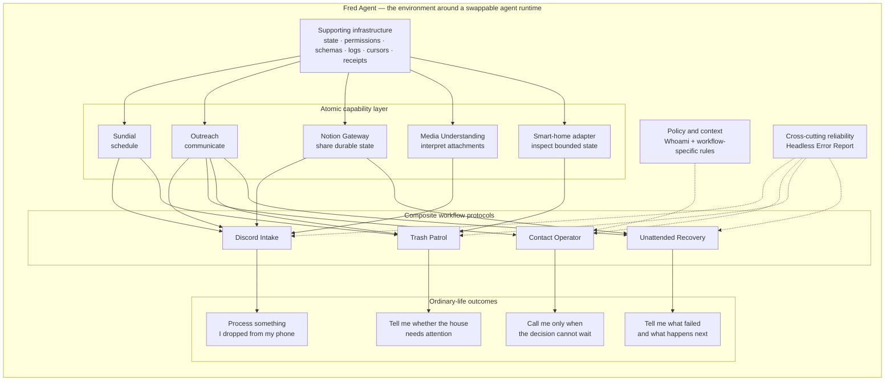
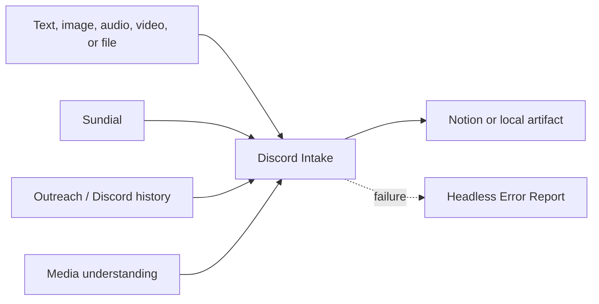
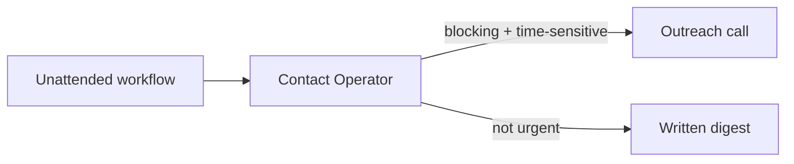
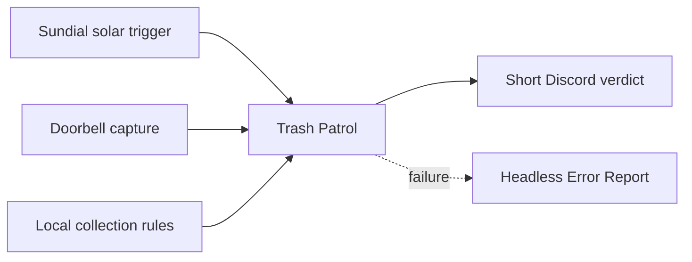
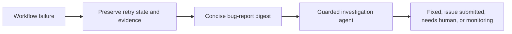

# Fred Agent System Overview — Content Draft

Provisional route: `Building-FredAgent-System.dc.html`
Reader question: How does everything connect?
Content mode: outcome-first architecture explainer

## Page title

**How Fred Agent Becomes Useful**

Subtitle:

`Start with the human task. Open the system beneath it.`

## Opening

Fred Agent is easier to understand from the outside in.

From the outside, it can look like a set of unrelated tricks: a phone call, a trash-bin check, a voice note becoming a Notion record, an unattended job reporting its own failure. From the inside, these experiences reuse the same small set of capabilities and operating rules.

The model supplies reasoning. The native agent harness supplies a terminal, files, tools, and a loop. Fred Agent supplies the environment around both: time, communication, shared state, personal context, workflow protocols, and recovery.

## What the agent can do

### Arrive at the right moment

Wake on a recurring schedule, relative to a solar event, when an external condition becomes true, or once at a future time.

### Reach the outside world

Place a phone call, send a message or email, post to Discord, and retrieve channel history without pretending the rest of the workflow is merely a send command.

### Inherit shared state

Read and update the same Notion workspace a human uses, while respecting schemas, approved destinations, dry runs, and the difference between a short receipt and a full audit trail.

### Receive messy context

Process text, images, audio, video, and files dropped from a phone without making the human classify and clean everything at capture time.

### Operate near the physical world

Use schedules, cameras, local rules, and human-facing channels to notice bounded real-world conditions.

### Preserve continuity

Carry identity facts, writing judgment, visual language, and project-specific operating rules across agent runtimes and sessions.

### Spend human attention deliberately

Remain quiet when work is progressing, leave a digest when reaching milestones/the issue can wait, and call only when a blocking decision is time-sensitive.

### Recover visibly

Preserve retry state, capture evidence, report the failure, and investigate it without creating an infinite chain of agents reporting agents.

## The layered system

The core visual has three readable layers: atomic handles, workflow protocols, and ordinary-life outcomes. Supporting infrastructure, policy, and reliability remain visible as rails around them.



Fred Agent is the enclosing field, not another peer in the composite layer. The runtime may change; the relationships among task, protocol, capabilities, policy, and evidence are the durable subject.

### Swappable agent runtime

Codex, Claude Code, or another capable terminal-native agent provides the reasoning loop. Fred Agent does not require one model’s private memory to become the operating system for a life.

### Supporting infrastructure

The substrate makes work reconstructable: schedules, local state, Git-tracked definitions, authenticated interfaces, stable identifiers, schemas, logs, cursors, and execution receipts.

### Capability interfaces

These are relatively atomic handles: Sundial for time, Outreach for communication, Notion Gateway for shared state, media understanding for attachments, and other adapters for calendars or the home.

### Knowledge and workflow protocols

Some modules supply judgment rather than transport. Whoami controls access to personal context. The article and visual guides preserve creative continuity. Composite protocols such as Discord Intake or Trash Patrol combine several capabilities with timing, state, failure rules, and human handoff.

### Human-scale outcomes

The final output should be legible without understanding the stack. A person sees the appointment, the preserved note, the short verdict, the finished draft, or the useful failure report.

## Interaction specification: trace the composition

The diagram should behave like a dependency map, not an animated poster. Its resting state is calm and completely readable. Interaction answers one question: **what had to compose for this result to exist?**

### Default state

- Keep the three layers visible at once: **ordinary-life outcomes** at the top, **workflow protocols** in the middle, and **atomic handles** at the bottom.
- Keep infrastructure, policy/context, and reliability visible as quieter rails rather than forcing them into the three-layer taxonomy.
- Show every node label before interaction. Motion may explain a relationship, but it must not be required to discover one.

### Selection behavior

- **Hover or keyboard focus previews a path.** The selected node, its connectors, and every node on the path gain emphasis; unrelated material becomes quieter but does not disappear.
- **Click or tap locks the selection and opens its concise explainer.** Clicking the same node again, the background, or pressing Escape clears it.
- **Select an outcome to trace toward its foundations.** Reveal the workflow protocol that owns it, the atomic handles it composes, and the supporting rails it depends on.
- **Select a workflow protocol to trace both ways.** Reveal the outcomes it enables and the handles it composes.
- **Select an atomic handle to trace toward every outcome it helps enable.** This makes reuse visible rather than merely claimed.

### Motion behavior

The selected path should assemble from the atomic layer upward: capability nodes gain emphasis, connector lines draw into the composite protocol, and the final line reaches the use case. This is one short, causal animation. The diagram should not float, pulse, or move in its resting state.

The active path needs more than colour: line weight, node outline, and a persistent text summary should carry the same state. Under reduced motion, the final highlighted state appears immediately without line drawing or cross-fades.

### Explanatory panel

Locking any node opens a compact text panel beside or below the map. It uses the same content model at every level:

```text
USE CASE
Process something I dropped from my phone

COMPOSED AS
Discord Intake

USES
Sundial · Outreach · Media Understanding · Notion Gateway

WHY THESE PIECES
Wake later, recover the channel history, stage the attachment,
understand it, preserve the result, then advance the cursor.
```

On touch screens, tapping a node both selects it and opens this panel. The mobile layout may become a vertical trace; it should preserve the dependency relationships rather than shrink the desktop geometry.

### Content model for implementation

The visual and the explanatory panel should be driven by one relationship map. Each node needs a stable ID, layer, one-line description, and related node IDs. Adding a future workflow should therefore mean extending the map, not redrawing the whole composition by hand.

## Composition recipes

The first release should foreground three paths. Together they show asynchronous intake, deliberate interruption, and a bounded physical-world task. Unattended recovery remains a cross-cutting fourth path rather than another equal-weight showcase.

### 1. Process something I dropped from my phone



Human experience:

> I drop the messy input. The system stages it, understands what it can, performs the requested work, preserves the result, and advances its cursor only after the side effects succeed.

### 2. Call me only when the decision cannot wait



Human experience:

> Most work stays quiet. A real blocking decision can ring the phone. Everything else waits in a form I can review later.

### 3. Notice a household obligation



Human experience:

> The system checks the actual scene around the time the obligation matters, compares it with the local rule, and tells me only what needs attention.

### Cross-cutting path: close the loop on an unattended failure



Human experience:

> I should not discover a week later that an automation quietly stopped. The system leaves a short operational status and enough evidence to continue.

## Cross-cutting rails

The vertical stack explains composition. Four rails explain whether the result is trustworthy.

### Time

When should the agent become present, and when should it remain asleep?

### State

What must survive the current session, and which surface is canonical for humans and agents?

### Attention

What can remain silent, what deserves a digest, and what justifies interrupting a person?

### Evidence

What must be preserved so success, failure, retry, and cleanup can be reconstructed later?

## What Fred Agent is not

- It is not a new foundation model.
- It is not a custom personality wrapped around one provider.
- It is not a universal autonomous agent.
- It is not a catalog of API wrappers with no operating rules between them.
- It is not proof that every personal workflow should be automated.

It is a growing environment for making selected parts of life legible and actionable to a general-purpose agent.

## Continue reading

- **Why these boundaries exist:** Design Principles
- **What each component owns:** Component Field Guide
- **What the system has actually done:** Demos

## Content notes for review

- The attached hand sketch establishes the information structure: outcomes above workflow protocols above atomic handles. It is not a style reference to reproduce literally.
- Fred Agent should read as the containing system, not as one composite-workflow node.
- The final system visual supports both entry directions: select a use case to reveal its dependencies, or select a capability to reveal where it is reused.
- Discord Intake, Contact Operator, and Trash Patrol are the three foreground recipes. Unattended Recovery is the cross-cutting fourth path.
